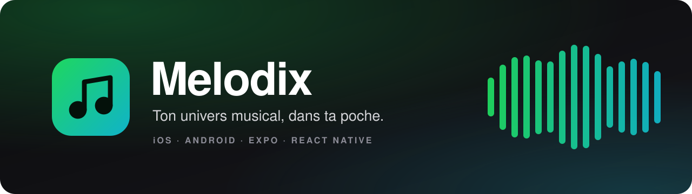

<p align="center">
  
</p>

<p align="center">
  <a href="https://github.com/Souxch06/Melodix/releases/latest"></a>
  
  
  
  
  <a href="LICENSE"></a>
</p>

<p align="center">
  <strong>Melodix</strong> transforme ton compte Spotify en tableau de bord musical de poche :<br>
  écoutes récentes, favoris du moment et toute ta bibliothèque, dans une interface sombre et animée.
</p>

<p align="center">
  <a href="#fonctionnalités">Fonctionnalités</a> •
  <a href="#démarrage-rapide">Démarrage rapide</a> •
  <a href="#état-du-projet">État du projet</a> •
  <a href="https://github.com/Souxch06/Melodix/releases">Téléchargements</a>
</p>

## Fonctionnalités

| Écran | Ce que tu y trouves |
| :-- | :-- |
| **Connexion** | Authentification OAuth sur la page officielle de Spotify : ton mot de passe ne transite jamais par l'app. |
| **Accueil** | Écoutes récentes, albums et artistes du moment, tes playlists et les playlists populaires. |
| **Recherche** | Toutes les catégories musicales de Spotify, présentées en grille. |
| **Bibliothèque** | Playlists, podcasts, albums et artistes suivis, filtrables par catégorie avec transitions animées. |
| **Album** | Pochette sur fond dégradé, artistes, liste des titres, autres albums de l'artiste et mentions de copyright. |
| **Playlist** | Couverture, description, créateur, nombre d'abonnés et liste des titres. |

Ta bibliothèque et ton profil sont mis en cache sur l'appareil pour que l'app s'ouvre plus vite.

> [!NOTE]
> Melodix sert à **explorer** ta musique : l'application ne lit pas les morceaux.

## Stack technique

- **Expo SDK 51** et **React Native 0.74** (React 18), entièrement en **TypeScript**
- **Expo Router** : navigation par fichiers, avec onglets et piles d'écrans
- **Reanimated** et **Gesture Handler** pour les animations et les gestes
- **expo-auth-session** (OAuth Spotify), **Axios** (API Web Spotify) et **AsyncStorage** (session)
- **Jest** et **Testing Library** (29 fichiers de tests), **ESLint**, **Prettier** et **Husky**

## Démarrage rapide

> [!IMPORTANT]
> Pour pouvoir te connecter, la connexion Spotify doit d'abord être adaptée aux règles actuelles de Spotify (voir [État du projet](#état-du-projet)). Les étapes ci-dessous restent valables pour installer et lancer l'app.

### Prérequis

- **Node.js 20** (voir `.nvmrc`) et **Yarn 1.22** ou plus récent
- Un **émulateur Android** ou le **simulateur iOS** (sur Mac) : la CLI Expo y installe automatiquement la version d'Expo Go adaptée au SDK 51. Les versions d'Expo Go des stores ne prennent plus en charge ce SDK : sur un vrai téléphone, cherche une version compatible sur [expo.dev/go](https://expo.dev/go) (Android) ou utilise un build de développement (`npx expo run:android` / `npx expo run:ios`).
- Un compte **Spotify Premium** : Spotify l'exige depuis février 2026 pour créer une application développeur.

### 1. Récupérer le projet

Télécharge l'archive de la [dernière version](https://github.com/Souxch06/Melodix/releases/latest), ou clone le dépôt :

```bash
git clone https://github.com/Souxch06/Melodix.git
cd Melodix
nvm use        # facultatif : bascule sur Node 20
yarn install
```

### 2. Créer ton application Spotify

1. Ouvre le [tableau de bord Spotify for Developers](https://developer.spotify.com/dashboard) et crée une application utilisant la **Web API**.
2. Dans **Redirect URIs**, ajoute l'URI de retour utilisée par l'app. Avec Expo Go, elle ressemble à `exp://192.168.1.20:8080` (adresse IP de ton ordinateur et port du serveur Expo). Pour connaître la tienne, ajoute temporairement `console.log(makeRedirectUri())` dans `screens/LoginScreen.tsx`.
3. Dans **User Management**, ajoute l'e-mail de chaque compte Spotify qui utilisera l'app (5 au maximum en mode développement).
4. Copie le **Client ID** et le **Client Secret** de l'application.

### 3. Configurer les variables d'environnement

Crée un fichier `.env` à la racine du projet (il est déjà ignoré par Git) :

```dotenv
CLIENT_ID=ton_client_id
CLIENT_SECRET=ton_client_secret
AUTHORIZATION_ENDPOINT=https://accounts.spotify.com/authorize
TOKEN_ENDPOINT=https://accounts.spotify.com/api/token
TOKEN_KEY=melodix_token
REFRESH_TOKEN_KEY=melodix_refresh_token
EXPIRATION_KEY=melodix_token_expiration
```

Les trois variables `*_KEY` sont simplement les noms des clés de stockage local de la session : n'importe quelles valeurs distinctes conviennent.

> [!WARNING]
> Ces valeurs sont intégrées à l'application compilée, **Client Secret compris**. Garde tes builds pour un usage personnel et ne publie jamais ton fichier `.env`.

### 4. Lancer l'application

```bash
yarn dev           # démarre Expo sur le port 8080 (appuie sur « a » pour Android, « i » pour iOS)
yarn dev:android   # démarre Expo sur le port 8081 et ouvre l'app sur Android
yarn dev:ios       # démarre Expo et ouvre l'app dans le simulateur iOS
```

L'app n'a pas de version web.

## Scripts utiles

| Commande | Rôle |
| :-- | :-- |
| `yarn dev` | Démarre le serveur Expo (port 8080) |
| `yarn dev:android` / `yarn dev:ios` | Démarre Expo et ouvre l'app sur Android / iOS |
| `yarn test` | Lance les tests Jest (`test:watch` et `test:coverage` disponibles) |
| `yarn lint` | Analyse le code avec ESLint |
| `yarn prettier:check` / `yarn prettier:write` | Vérifie / applique le formatage Prettier |
| `yarn bump-to-support` | Aligne les dépendances sur les versions prises en charge par le SDK Expo |

## Structure du projet

```text
Melodix/
├── app/          # Routes Expo Router : connexion, onglets (accueil, recherche, bibliothèque), pages de détail
├── screens/      # Écrans : connexion, album, playlist…
├── components/   # Composants d'interface : sections de l'accueil, bibliothèque, aperçus, cartes…
├── navigators/   # Barre d'onglets personnalisée
├── api/          # Appels à l'API Web Spotify et gestion des jetons
├── models/       # Types des données affichées
├── utils/        # Conversion des réponses de l'API en modèles, fonctions utilitaires
├── context/      # États partagés : utilisateur, catégorie de bibliothèque
├── config/       # Couleurs, constantes, types, valeurs de repli
├── data/         # Textes de l'interface
├── hooks/        # Hooks React personnalisés
└── assets/       # Polices et images
```

Les imports utilisent des alias TypeScript (`@api`, `@components`, `@config`…) définis dans `tsconfig.json`.

## État du projet

Spotify a fortement restreint son API depuis la création du projet d'origine. Voici où en est Melodix :

| Sujet | État | Détail |
| :-- | :-: | :-- |
| Connexion Spotify | ⚠️ | L'app utilise encore le flux OAuth *Implicit Grant*, que Spotify a [supprimé le 27 novembre 2025](https://developer.spotify.com/blog/2025-10-14-reminder-oauth-migration-27-nov-2025). Il faut passer au flux *Authorization Code + PKCE* ([guide de migration](https://developer.spotify.com/documentation/web-api/tutorials/migration-implicit-auth-code)). |
| Playlists populaires | ⚠️ | L'endpoint des playlists mises en avant est fermé aux nouvelles applications depuis le [27 novembre 2024](https://developer.spotify.com/blog/2024-11-27-changes-to-the-web-api), tout comme les recommandations (déjà désactivées dans le code). |
| Mode développement | ℹ️ | Depuis [février 2026](https://developer.spotify.com/blog/2026-02-06-update-on-developer-access-and-platform-security) : compte Premium obligatoire, 5 utilisateurs autorisés par application et accès réduit à certains endpoints. |
| Pages Artiste, Podcast, Épisode | 🚧 | Pas encore réalisées : elles n'affichent que l'identifiant de l'élément. |
| Recherche par texte | 🚧 | Pas encore disponible : l'onglet Recherche affiche pour l'instant les catégories. |
| Identité visuelle | 🚧 | L'app affiche encore le nom, le logo et les textes du projet d'origine, inspirés de Spotify. |
| Langue | ℹ️ | L'interface est en anglais (textes dans `data/en-gb.ts`). |
| Builds EAS | ℹ️ | `app.config.js` contient l'identifiant EAS du projet d'origine : remplace-le par celui de ton projet Expo (`eas init`) et crée un `eas.json` (`eas build:configure`) avant d'utiliser les scripts `build:*`. |

<sub>⚠️ bloquant ou dégradé · 🚧 à faire · ℹ️ à savoir</sub>

## Feuille de route

- [ ] Migrer la connexion vers *Authorization Code + PKCE*
- [ ] Remplacer les sections qui dépendent d'endpoints retirés
- [ ] Réaliser les pages Artiste, Podcast et Épisode
- [ ] Ajouter la recherche par texte
- [ ] Donner à l'app sa propre identité : nom, icône, écran de démarrage et textes Melodix
- [ ] Traduire l'interface en français

## Crédits et licence

- Melodix est basé sur le projet open source [spotify-clone](https://github.com/dhunanyan/spotify-clone) de [@dhunanyan](https://github.com/dhunanyan). Le code est distribué sous [licence MIT](LICENSE).
- Les données musicales proviennent de l'[API Web Spotify](https://developer.spotify.com/documentation/web-api). Melodix est un projet indépendant, ni affilié à Spotify AB ni approuvé par Spotify ; « Spotify » est une marque déposée de Spotify AB.
- Les polices SF Pro Display incluses sont la propriété d'Apple Inc. et relèvent de leur propre licence.

<p align="center">
  <sub>Maintenu par <a href="https://github.com/Souxch06">@Souxch06</a></sub>
</p>
